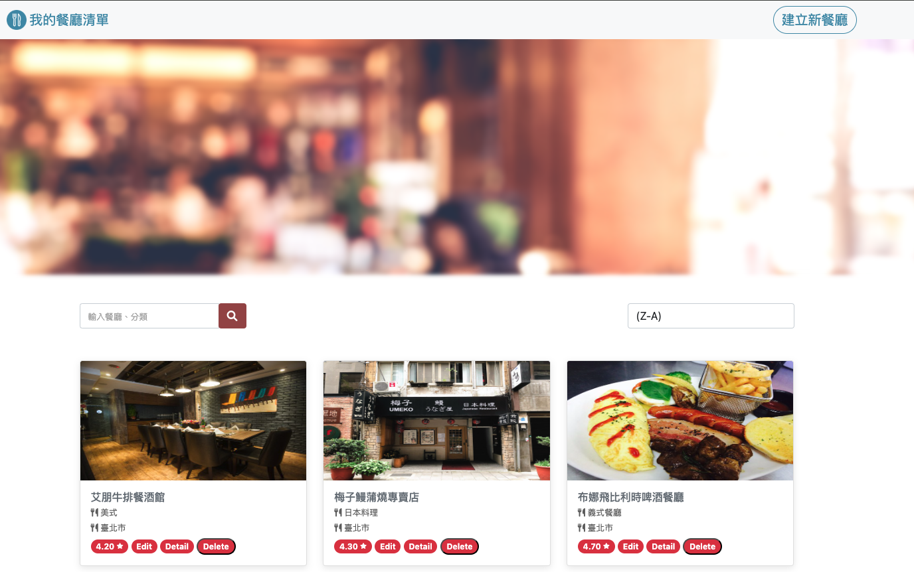

# 我的餐廳清單

這個專案是 AlphaCamp 全端網頁課程，C4 成為軟體工程師 - 後端專修， M1 章節的實作作業。主要是透過 Node.js、Express 框架，練習一個簡易的餐廳清單應用程式（Web Applicaton）。

主要功能有：餐廳清單的瀏覽、餐廳細部介紹，以及透過搜尋功能（餐廳名稱或類別），來找到符合條件的餐廳。另外使用者可以自行新增、修改、刪除特定的餐廳資料。

- 
- 
- 
- 
- 

## Getting Started

### Prerequisites

若要嘗試執行此份專案，環境部分您需要先準備以下（由於作者使用 macOS，以下指令以 macOS 為主）：

1. 安裝 Node Version Manager (nvm)

```
$ curl -o- https://raw.githubusercontent.com/creationix/nvm/v0.39.0/install.sh | bash
```

2. 使用 Node Version Manager (nvm) 安裝 node.js 並使用指定版本(`node.js @v18.15.0`)

```
$ nvm install 18.15.0
```

```
$ nvm use 18.15.0
```

3. 檢查是否有安裝成功，並確認 node.js 版本

```
node -v
```

### Installing

1. 將本專案從 GitHub Clone 到自己的本機，並切換到專案資料夾

```
https://github.com/PoMingChen/AC_C4_M1_RestaurantList_CRUD.git
```

2. 透過 npm 安裝所需的套件，並請留意 `package.json` 中的相依套件版本

```
npm install
```

3. 匯入種子資料

- 首先確保個人本地端的資料庫有啟動，並建立一個名稱為 `restaurant` 的資料庫，以及一個 `restaurantlists` 資料表。
- 確認個人本地端，與該資料庫的連線帳密是否一致
- 以本專案路徑下的 `./seeders/20240914152946-add-sample-restaurant-data.js` 執行以下指令，完成匯入。

```
npx sequelize db:seed:all
```

- 補充：由於本專案已經有先透過 sequelize 建立 model instance（modelName: `restaurantlist`），並且完成 migration，因此可以省略以下動作，直接執行種子資料的匯入。以下指令必要時可以自行回顧。

```
npx sequelize init
```

```
 npx sequelize model:generate --name restaurantlist --attributes name:string, ... //initiate all the columns corresponding to the table schema in your database.
```

```
npx sequelize db:migrate
```


## Running the tests

- 尚未實作

## Deployment

1. 啟動伺服器，執行 app.js 檔案

```
nodemon app.js
```

2. 開啟瀏覽器，並輸入以下網址 `http://localhost:3000`

## Built With

- [Node.js](https://nodejs.org/en)
- [Express](https://expressjs.com)
- [Express Handlebars](https://www.npmjs.com/package/express-handlebars)
- [前端網頁頁面設計 1]（https://codepen.io/alpha-camp/pen/yrLbrZ）-由 AlphaCamp 提供
- [前端網頁頁面設計 2]（https://codepen.io/alpha-camp/pen/JVjNgG）-由 AlphaCamp 提供

## Contributing

- 無

## Versioning

- 無

## Authors

- [PoMingChen](https://github.com/PoMingChen)

## License

- 無

## Acknowledgments

- [AlphaCamp](https://tw.alphacamp.co/) 導師與助教群
